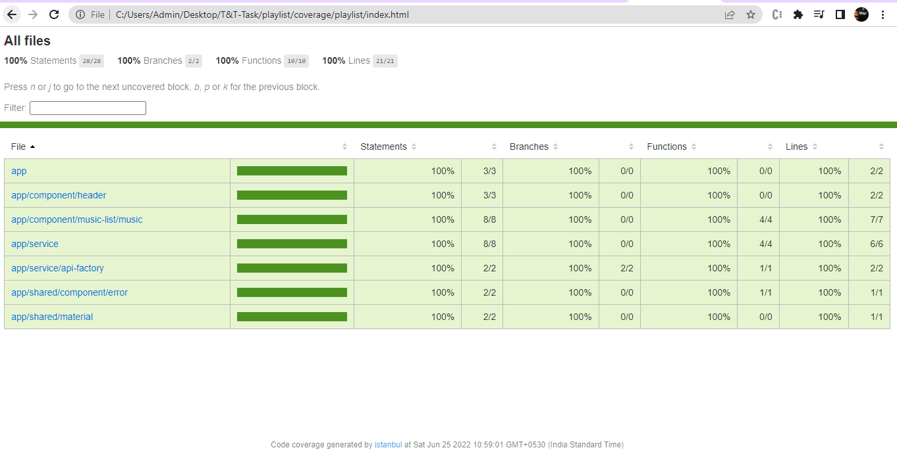
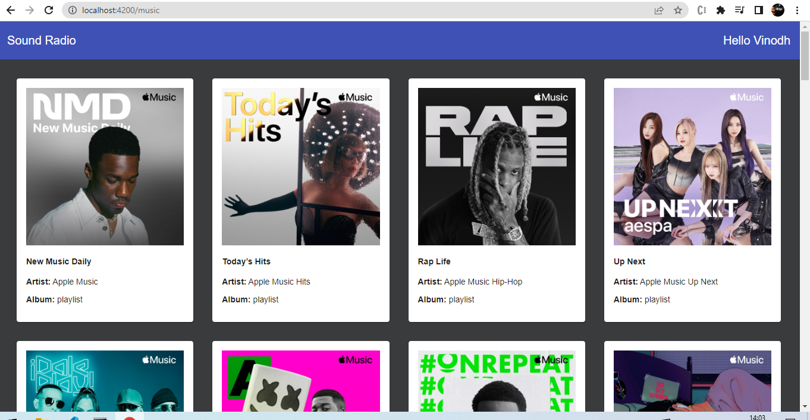

# Project Name
> Playlist App.
> Live demo [_here_](https://new-playlist-app.web.app/music).


## Table of Contents
* [General Info](#general-information)
* [Technologies Used](#technologies-used)
* [Setup](#setup)
* [Screenshots](#screenshots)
* [Project Status](#project-status)
* [Room for Improvement](#room-for-improvement)
* [Contact](#contact)


## General Information
- A sample project created to display the playlists
- Linting and prettier are used to format the code
- Lazy loading of module is used for performance
- 100% code coverage using karma
- Have used async pipes inorder to avoid the memory leaks


## Technologies Used
- Angular 14
- HTML
- CSS
- Karma
- Angular Material


## Setup
1. clone the [repository](https://github.com/jdvinodh/playlist.git) to your local machine:
```bash
$ git clone https://github.com/jdvinodh/playlist.git
```

2. Run `npm install` inside the downloaded/cloned folder:
```bash
$ npm install
```

3. Start the dev server by running the command below. Navigate to `http://localhost:4200/`. The app will automatically reload if you change any of the source files.
```bash
$ ng serve
```

4. Start the karma by running the command below. Navigate to `http://localhost:9876/`. The app will automatically reload if you change any of the source files.
```bash
$ ng test --code-coverage
```
5. Inorder to see the code coverage
    - Go to {{project_folder}}\playlist\coverage\playlist
    - Open index.html to view the code coverage 


## Screenshots




## Project Status
Project is: Complete


## Room for Improvement
Using Ngrx


## Contact
Created by Vinodh JD
